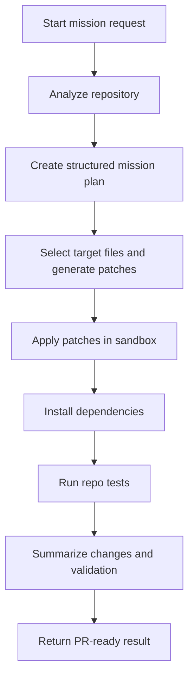
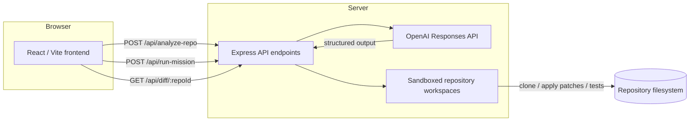

# BuildsOps Copilot

> Turn a repository mission into a reviewable, tested code change with a single backend-powered run.

[](https://nodejs.org/)
[](https://www.typescriptlang.org/)
[](https://react.dev/)
[](https://vitejs.dev/)
[](https://expressjs.com/)
[](https://openai.com/)
[](#license)

---

## Overview

BuildsOps Copilot is a developer-focused automation tool for turning maintenance goals into reliable code updates. It analyzes a repository, creates a mission plan, generates patch diffs, validates them with the repo's own test workflow, and returns PR-ready summaries.

This repo is production-ready for Node.js/TypeScript repositories, with a backend that already integrates OpenAI Responses API and a React/Vite frontend launcher.

## Quick look

| Problem | Solution | Current supported stack | Future direction |
|---|---|---|---|
| Manual repo maintenance tasks are slow and error-prone | Automated mission planning, patch generation, test validation, and summary output | Node.js + TypeScript + Express + Vite | Expand multi-stack support to Python, Java, Go, Rust, and more |

## Key capabilities

- Repo inspection and metadata analysis for Node/TypeScript apps
- AI-guided mission planning with structured, schema-validated output
- Patch generation as unified git diffs
- Sandbox workspace patch application and npm test validation
- PR-ready summaries and commit message suggestions
- Frontend workflow for repo URL + mission input

## Demo / screenshots

<!-- Replace with actual screenshot: ./docs/images/dashboard-home.png -->


<!-- Replace with actual screenshot: ./docs/images/mission-results.png -->


> Tip: keep screenshots focused on the run workflow and result diff summary.

## How it works

1. Analyze repo metadata and detect language, package scripts, controllers, routes, and tests.
2. Plan the requested mission using an AI planning agent.
3. Generate code patches from the plan with a Codex-style patch generation agent.
4. Apply patches in a sandbox workspace and execute repository tests.
5. Summarize the final change set for review or PR creation.

### Mission lifecycle



## Architecture



## Tech stack

- **Backend:** Node.js 20+, TypeScript, Express, dotenv, zod
- **Frontend:** React 18, Vite, TypeScript, lucide-react
- **AI integration:** OpenAI Responses API, structured schema validation, configurable models
- **Repo tooling:** sandboxed workspace cloning, npm install, npm test, unified diff patching

## Project structure

### `server/`

```text
server/
  package.json
  tsconfig.json
  src/
    index.ts
    app.ts
    errors.ts
    types.ts
    routes/apiRoutes.ts
    controllers/
      diffController.ts
      missionController.ts
      repoController.ts
    services/
      diffService.ts
      missionService.ts
      repoAnalysisService.ts
      process.ts
    ai/
      codex.ts
      openaiClient.ts
      planner.ts
      summaries.ts
    workspace/
      diff.ts
      git.ts
      patches.ts
      paths.ts
      process.ts
      runner.ts
    tests/
      git.test.ts
      paths.test.ts
```

### `web/`

```text
web/
  package.json
  tsconfig.json
  vite.config.ts
  src/
    main.tsx
    App.tsx
    api/
      buildops.ts
    components/
      MissionForm.tsx
      MissionResults.tsx
      RepoSummary.tsx
    pages/
      HomePage.tsx
      ResultsPage.tsx
    styles.css
```

## Getting started

### Prerequisites

- Node.js 20 or newer
- npm installed
- OpenAI API key for mission execution

### Clone and install

```bash
git clone https://github.com/<your-org>/BuildsOps-Copilot.git
cd BuildsOps-Copilot
cd server && npm install
cd ../web && npm install
```

### Backend environment variables

Create `server/.env` with at least:

```env
OPENAI_API_KEY=your_openai_api_key
OPENAI_PLANNER_MODEL=gpt-5.6-terra
OPENAI_CODEX_MODEL=gpt-5.3-codex
OPENAI_SUMMARY_MODEL=gpt-5.6-terra
WORKSPACE_ROOT=./workspaces
WEB_ORIGIN=http://localhost:5173
```

### Frontend environment variables

Create `web/.env` if you need to override the API URL:

```env
VITE_API_URL=http://localhost:4000
```

### Run backend

```bash
cd server
npm run dev
```

### Run frontend

```bash
cd web
npm run dev
```

Then open the local Vite URL shown in the terminal.

## Environment variables

| Variable | Required | Purpose |
|---|---|---|
| OPENAI_API_KEY | yes | OpenAI key for mission planning, patch generation, and summaries |
| OPENAI_PLANNER_MODEL | no | Planner model override (default: `gpt-5.6-terra`) |
| OPENAI_CODEX_MODEL | no | Patch generation model override (default: `gpt-5.3-codex`) |
| OPENAI_SUMMARY_MODEL | no | Summary generation model override (default: same as planner) |
| WORKSPACE_ROOT | no | Root path for cloned repositories and sandbox workspaces |
| WEB_ORIGIN | no | Allowed CORS origin for the frontend |
| VITE_API_URL | no | Frontend API endpoint URL |

## API endpoints

### `POST /api/analyze-repo`

Analyze a repository and create a sandbox workspace.

Request body:

```json
{ "repoUrl": "https://github.com/example/repo.git" }
```

Response: `201` with repository summary metadata.

### `POST /api/run-mission`

Run a mission against an analyzed repository.

Request body:

```json
{
  "repoId": "repo-xxxxxxxxxxxxxxx",
  "mission": "Add request logging middleware to all Express routes."
}
```

Response: mission result, including plan, patches, test results, and PR-ready summary.

### `GET /api/diff/:repoId`

Return the current diff for the workspace repository.

Response: diff text plus changed file list.

### `GET /api/health`

Health check for the backend service.

Response: `200` if the server is running.

## Example mission flow

```bash
curl -X POST http://localhost:4000/api/analyze-repo \
  -H "Content-Type: application/json" \
  -d '{"repoUrl":"https://github.com/example/node-api.git"}'
```

```bash
curl -X POST http://localhost:4000/api/run-mission \
  -H "Content-Type: application/json" \
  -d '{"repoId":"repo-1234abcd5678efgh","mission":"Add structured logging to all API routes."}'
```

The backend will:
- clone the repo into `workspaces/`
- analyze the package and code structure
- generate a mission plan and patch set
- apply patches and run `npm test`
- return review-ready output

## Current scope

BuildsOps Copilot currently targets Node.js and TypeScript repositories with npm-based workflows. The backend is designed to evolve toward multi-stack support, but the safe runtime and mission generation path is currently validated for Node/TypeScript only.

## Roadmap

- [x] Repo analysis for Node.js/TypeScript projects
- [x] Structured AI mission planning
- [x] Unified diff generation and patch application
- [x] Test execution inside sandboxed repository workspaces
- [ ] Python repo support
- [ ] Java and JVM support
- [ ] Go / Rust support
- [ ] UI workflows for PR creation and diff review

## Troubleshooting

### `OPENAI_API_KEY` missing

The server throws `ai_not_configured` if `OPENAI_API_KEY` is not set. Add it to `server/.env` and restart the backend.

### Frontend cannot reach backend

Verify `VITE_API_URL` is set correctly or the backend is running on `http://localhost:4000`. Also verify `WEB_ORIGIN` matches the frontend origin.

### Tests fail in sandbox

The mission result will include the test command and output. Review the repo's `package.json` and fix any local environment issues before rerunning.

### Repo unsupported

If a repository does not contain a readable `package.json` or lacks a Node/TypeScript structure, the current analyzer may reject it. The tool is intentionally scoped to supported stacks.

## Contributing

1. Fork the repo.
2. Create a feature branch.
3. Add tests for new AI workflows or repo analysis logic.
4. Open a PR with a clear mission flow example.

> Contributions are most valuable when they improve mission safety, sandbox isolation, and multi-stack analysis.

## License

This repository MIT license file yet. Add a `LICENSE` in the project root to clarify reuse and contribution terms.
